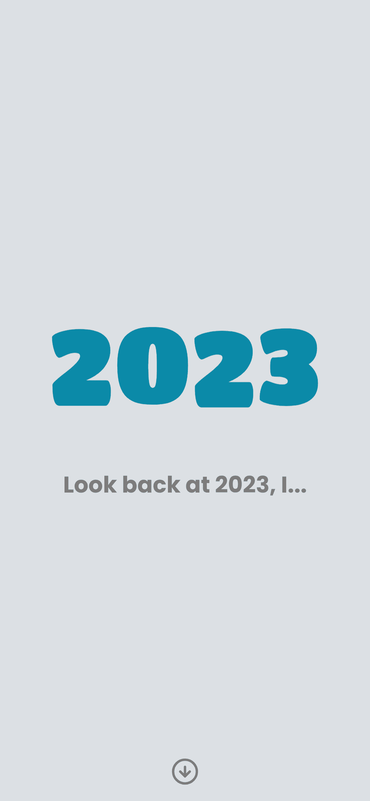

# 2023 Year in Review



Built with
- React + TypeScript + Vite
- Framer Motion

Bootstrapped with template `bunx create-vite my-app --template react-ts`


## Running Locally

Install dependencies and start dev server. 

```sh
bun install
bun run dev
```


## Inspirations

It seems like all platforms are doing some year wrap up of their own (e.g. Spotify's Wrapped, Duolingo), why not make one that is actually about my life?


## Credits

- International Flags created by Freepik - [FlatIcon](https://www.flaticon.com/packs/international-flags-6)
- Emojis designed by [OpenMoji](https://openmoji.org/) – the open-source emoji and icon project. License: CC BY-SA 4.0
